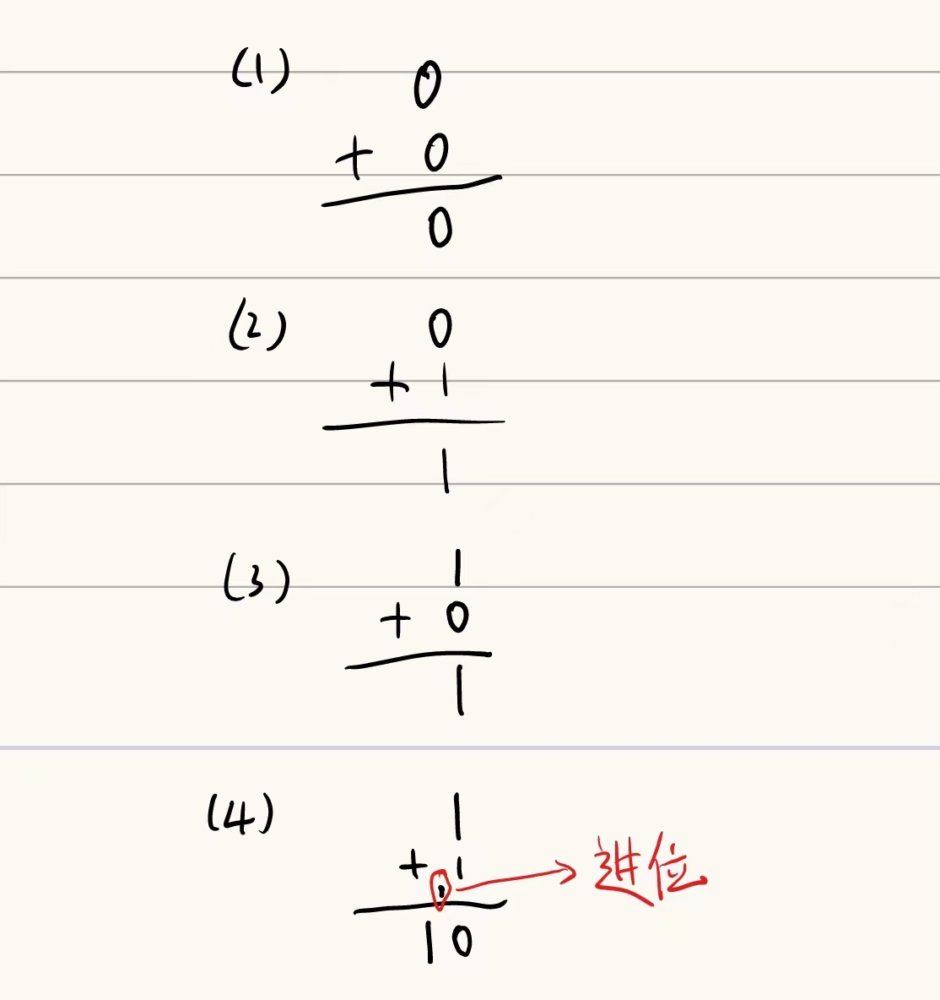
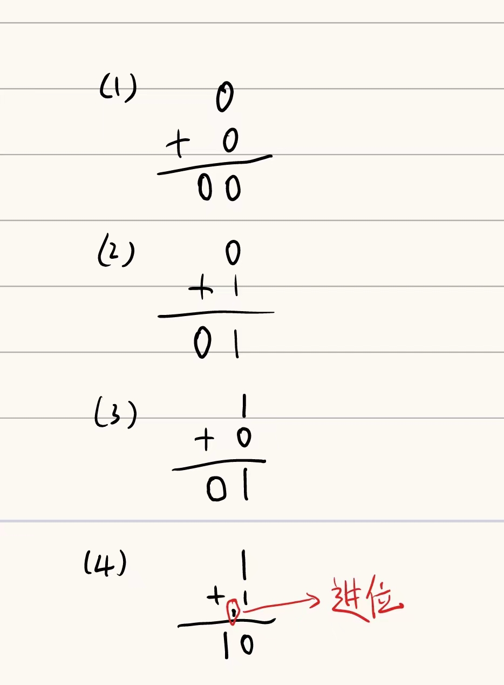
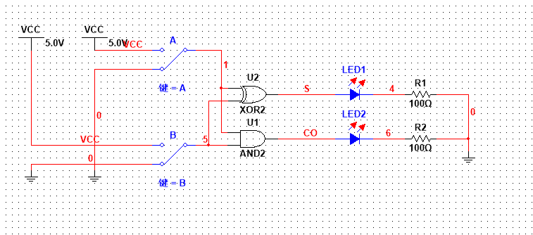
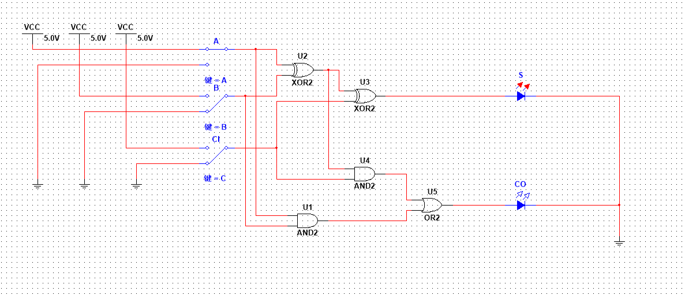
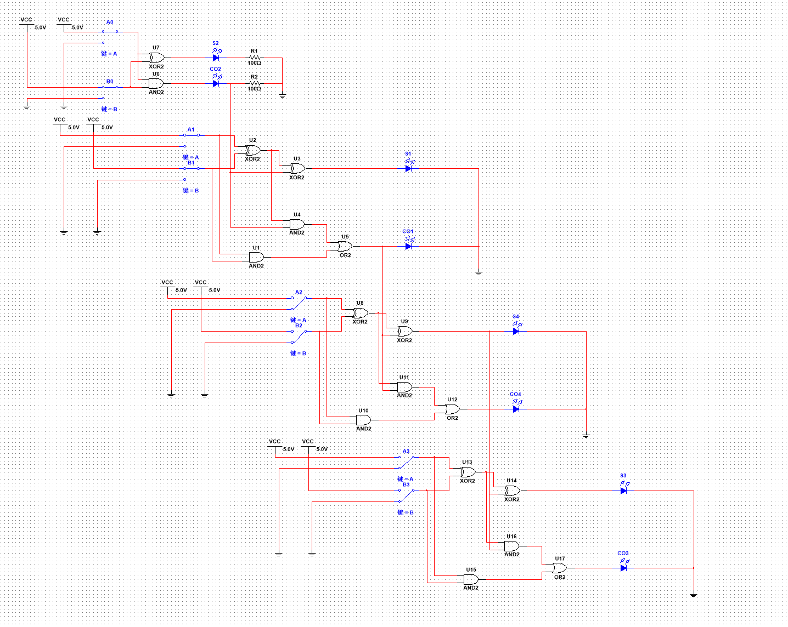
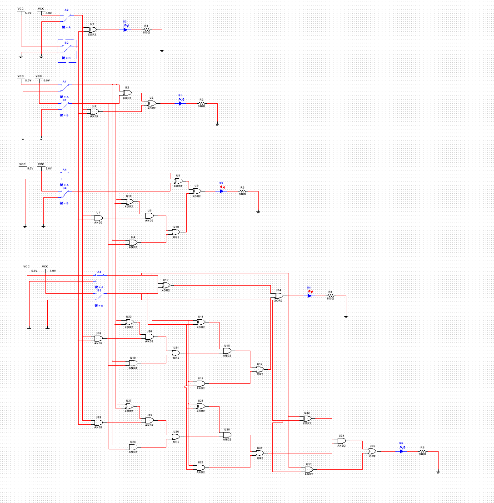

# 加法器的介绍与原理分析
##  什么是加法器？
加法器是一种数字电路，用于将两个二进制数相加并输出它们的和。
## 如何实现加法器
要讨论如何实现加法器就要先从只有一位的数字先进行考虑
### 一位二进制数相加
#### 不考虑来自低位的进位——半加器
对于一位二进制数相加，由于是二进制有可能要进位也可能不需要进位，根据具体的情况如下图所示：

没有进位的话，把进位补上0：

转化为列表如下：
数字A|数字B|输出S|进位CO
|:--:|:--:|:--:|:--:|
1|0|1|0
0|1|1|0
0|0|0|0
1|1|0|1

对于一位数字的话我们使用A表示第一个数字，B表示第二个数字，S表示加和之后的当前位的和，CO表示向高位的进位，使用逻辑函数式那么
$$\begin{align} S &= AB'+A'B\ \ (异或操作)\\ CO &= AB \ \ (与操作)\end{align}$$
也就是说对于一位二进制数的加法，我们可以使用异或操作跟与操作求出加法结果。
逻辑电路如图所示：

这样可以根据灯的亮灭判断到底输出了什么。
这样组成的期间就是半加器，但是半加器并没有考虑来自低位的进位，所以它的功能是不完善的。
#### 考虑来自低位的进位——全加器
如果考虑到来自低位的进位那么输入就会有三个分别是数字A、数字B与进位CI。
相加的过程中我们可以看作先将数字A与数字B相加，相加得到的加和再与进位CI相加，即全加器由两个半加器组成。
真值表为：
|数字A|数字B|进位CI|数字S|进位CO
|:--:|:--:|:--:|:--:|:--:|
0|0|0|0|0
0|0|1|1|0
0|1|0|1|0
0|1|1|0|1
1|0|0|1|0
1|0|1|0|1
1|1|0|0|1
1|1|1|1|1

根据真值表可以得到以下逻辑函数式
$$\begin{align} S &= AB'CI'+A'BCI'+A'B'CI+ABCI\\ CO &= ABCI'+A'BCI+AB'CI+ABCI \end{align}$$
将逻辑表达式进行化简得到
$$\begin{align} 
S &= CI'(AB'+A'B)+CI(A'B'+AB)\\
S &= CI'(AB'+A'B)+CI(AB'+A'B)'\\
S &= CI'(A\bigoplus B) + CI(A\bigoplus B)'\\
S &= CI\bigoplus A\bigoplus B\\
CO &= AB(CI'+CI)+CI(A'B+AB') \\
CO &= AB + CI(A\bigoplus B)\\
CO &= ABCI'+A'BCI+AB'CI+ABCI\\
\end{align}$$
最终我们得到的逻辑函数式为:
$$\begin{align} 
S &= CI\bigoplus A\bigoplus B\\
CO &= AB + CI(A\bigoplus B)\\
\end{align}$$
转化为电路图为：

这样我们就得到了一个全加器。
有了半加器与全加器，就能着手实现二进制加法了。
### 四位二进制加法器
最低位相加是不需要考虑进位的，所以使用半加器就行，当然使用全加器也可以只不过进位CI要置零。
现在就着手实现四位二进制数加法器：
多位加法器的原理就是，有多个一位加法器组成，每个一位加法器负责多位中的一位的运算，运算的结果需要进位到下一位，然后下一位求出结果，很明显这是一种
电路图如下:

如图所示，但是此加法器是一种串联的结构，进行运算时高位需要等待低位求出运算结果才能得到高位的结果，也就是花费的时间比较多，有没有办法在进行低位运算的同时进行高位的运算。
#### 超前进位四位加法器
如果我们不再使用先算低位进位，然后再算高位，而是直接根据低位数字直接算出应该到高位的进位，这样就能将串行结构改成并行结构，这样就能够大大减少运算所需的时间。

这样我们就能够将结构改成下面的样子：

从图中我们可以看出是根据原始输入计算的进位，而不是一位一位进行计算的进位，这样每一位数字就可以同时计算，这样就可以在一个时钟周期内完成加法运算。
但是这一个明显优缺点，到后面计算进位的电路越来越复杂。
至此关于加法器的原理就讲完了。

注：如果电路图，或者逻辑函数式有写错的，请在评论区@我，我会尽快修改的。
