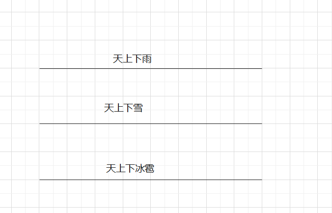
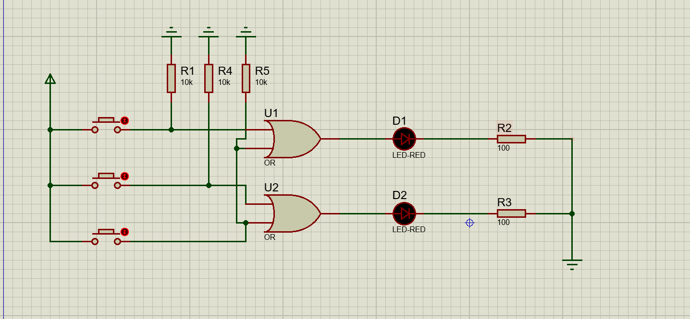
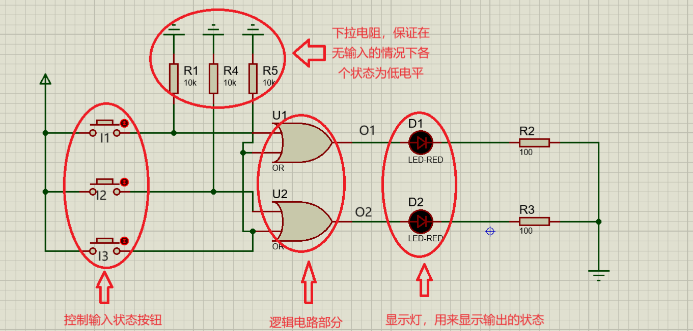
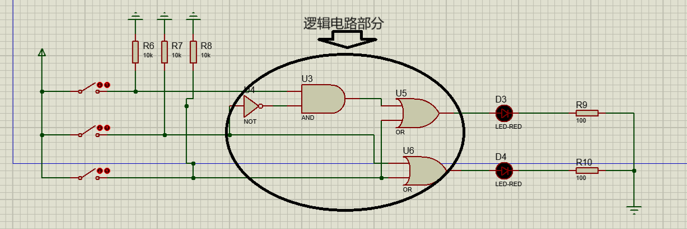

# 编码器
## 什么是编码器
编码器可以用来将信息编码成为二进制代码，有点类似于取代号，人为的将二进制代码与对应的信息联系起来。
如下图所示：
假设有这三种情况会发生，且每次只发生一种情况

为了给这三种情况做一个区分，做如下规则：
1. 天上下雨
2. 天上下雪
3. 天上下冰雹

这样就算对这些信息做了一个编码，但是这个编码是在计算机的外部进行的，这是一种人为的规定。
但是计算机使用电平的高低来表示内部信息的状态，这代表了计算机内部表示信息的方式是二进制，为了将上述信息转换成计算机能够处理的格式，我们便需要编码器来进行编码了。
不知道你有没有感到奇怪，说是编码器，但其实我们在设计电路的时候就预先考虑了对信息的编码，对每一种信息进行了考虑，每一个信息赋予了特殊含义的编码，然后使用编码器将其进行转换二进制。从这种意义上来说，编码器叫这个名字好怪啊！

## 编码器的原理
以4-2线编码器做分析，结合上述的三种情况做一个4-2线编码器，上述的情况注意表面上是三种情况但其实隐含了一种默认的状态那就是无输入状态这是一种默认的状态。(注：我在分析时将无输入状态作为了一种状态来考虑了，也可以将无输入状态，不作为一种状态考虑，但是需要考虑使用其他的标志位来进行标志)
此时共有的情况就有以下几种：
0.无输入
1.天上下雨用$I_1$表示
2.天上下雪用$I_2$表示
3.天上下冰雹用$I_3$表示
这样就能列出下面的真值表：
$I_1$|$I_2$|$I_3$|$O_1$|$O_2$
|:--:|:--:|:--:|:--:|:--:|
0|0|0|0|0
1|0|0|1|0
0|1|0|0|1
0|0|1|1|1

根据真值表可以得到这样这样的逻辑函数表达式：
$$\begin{align}O_2 &= I_2+I_3\\
O_1&= I_1+I_2
\end{align}$$
根据此逻辑函数式可以得到下面的电路图：

此电路图分为以下几部分：

接下来进行动态演示操作：

这样最基础的原理部分就解决了，但是现在这一个电路不允许同时有多个输入，如果同时有多个输入就会导致输出的错误，接下来我们就需要解决这个问题。
## 允许同时有多个输入的编码器——优先编码器
现在我们看一下如果要允许同时有多个输入，但是要对其中的某些输入进行优先编码，比如我们定义下面的优先级$I_3>I_2>I_1$,当$I_3$输入的时候无论$I_2$是什么状态都不影响输入,其余同理。这样可以得到下面的真值表：
$I_1$|$I_2$|$I_3$|$O_1$|$O_2$
|:--:|:--:|:--:|:--:|:--:|
0|0|0|0|0
1|0|0|1|0
❌|1|0|0|1
❌|❌|1|1|1

将所有的情况都列出来可以得到下面的真值表：
$I_1$|$I_2$|$I_3$|$O_1$|$O_2$
|:--:|:--:|:--:|:--:|:--:|
0|0|0|0|0
1|0|0|1|0
0|1|0|0|1
1|1|0|0|1
0|0|1|1|1
0|1|1|1|1
1|0|1|1|1
1|1|1|1|1

这样就可以得到下面的表达式
$$\begin{align}
O_1 &= I_1I_2'I_3'+I_1'I_2'I_3+I_1'I_2I_3+I_1I_2'I_3+I_1I_2I_3\\
O_2 &=  I_1'I_2I_3'+I_1I_2I_3'+I_1'I_2'I_3+I_1'I_2I_3+I_1I_2'I_3+I_1I_2I_3
\end{align}$$
对逻辑表达式进行简化得到：
$$\begin{align}
O_1 &= I_1I_2'+I3\\
O_2 &= I_3+I_2
\end{align}$$
搭建出的电路图如图所示：

动态演示效果如图所示：

# 总结
在本篇文章中，我以4-2线编码器为例，主要演示了编码器的原理和优先编码器的原理，在演示的过程中，我将无输入也当作一种输入状态进行分析，通过proteus进行仿真实验，进行搭建编码器，希望对你能够有所帮助。

如果有什么地方讲的不好或者讲错的地方欢迎大家指出来，如果我所讲的对你们有帮助不要忘了点赞、收藏、关注哦！

我是你们的好伙伴apprentice_eye

一个致力于让知识变的易懂的博主。
